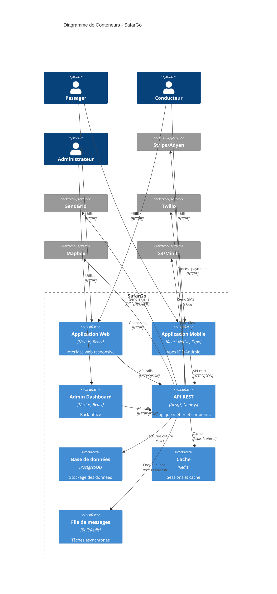

# SafarGo - Diagramme de Conteneurs C4

## Architecture des Conteneurs

## Description des Conteneurs

### Frontend

#### Application Web (Next.js)
- **Technologies**: Next.js 14, React 18, TypeScript, Tailwind CSS
- **Responsabilités**:
  - Interface utilisateur responsive
  - SSR pour le SEO
  - i18n FR/AR avec RTL
  - PWA capabilities

#### Application Mobile (React Native)
- **Technologies**: React Native, Expo, TypeScript
- **Responsabilités**:
  - Apps natives iOS/Android
  - Deep linking
  - Push notifications
  - Offline capabilities

#### Admin Dashboard (Next.js)
- **Technologies**: Next.js, React, TypeScript, Charts
- **Responsabilités**:
  - Gestion des utilisateurs
  - Modération du contenu
  - Import/export POI
  - Analytics et rapports

### Backend

#### API REST (NestJS)
- **Technologies**: NestJS, TypeScript, Prisma ORM
- **Responsabilités**:
  - Logique métier
  - Authentification JWT
  - Validation des données
  - Intégrations externes

#### Base de données (PostgreSQL)
- **Version**: PostgreSQL 15+
- **Caractéristiques**:
  - PostGIS pour les données géospatiales
  - Indexes optimisés
  - Réplication pour la haute disponibilité
  - Backups automatiques

#### Cache (Redis)
- **Usage**:
  - Sessions utilisateurs
  - Cache des requêtes fréquentes
  - Rate limiting
  - Real-time features

#### Queue (Bull/Redis)
- **Jobs asynchrones**:
  - Envoi d'emails/SMS
  - Traitement des paiements
  - Génération de rapports
  - Nettoyage des données