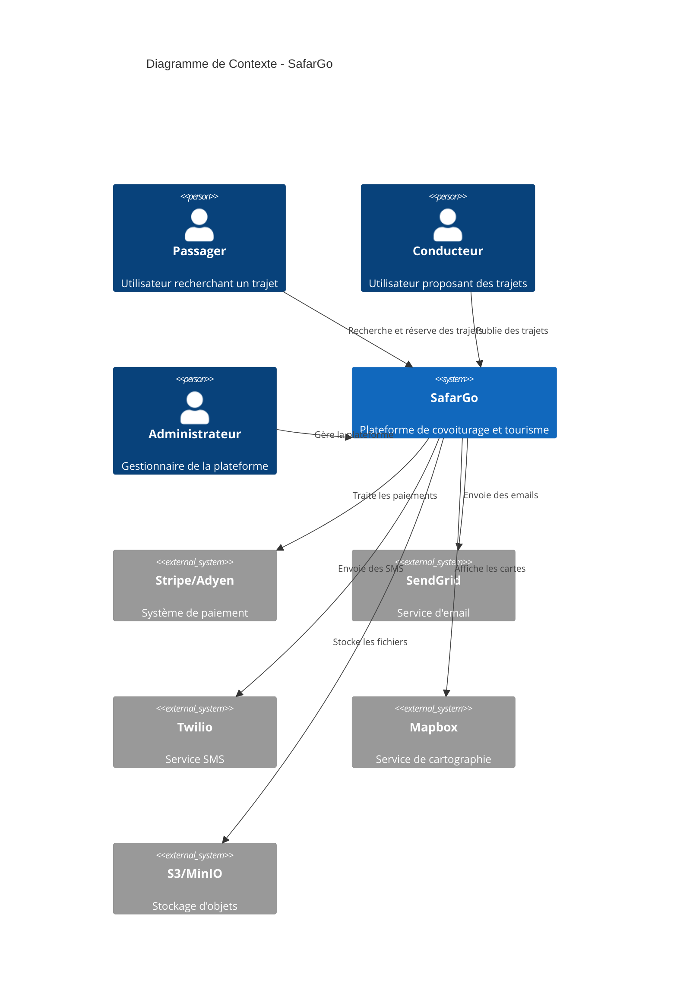

# SafarGo - Diagramme de Contexte C4

## Vue d'ensemble

SafarGo est une plateforme de covoiturage avec module tourisme pour l'Algérie.

## Acteurs

### Passager
- Recherche des trajets
- Réserve des places
- Paie après le trajet
- Évalue les conducteurs
- Explore les destinations touristiques

### Conducteur
- Publie des trajets
- Gère ses véhicules
- Reçoit les paiements
- Communique avec les passagers
- Crée des trajets touristiques

### Administrateur
- Modère le contenu
- Gère les litiges
- Import/export des POI
- Analyse les métriques
- Configure la plateforme

## Systèmes Externes

### Paiement (Stripe/Adyen)
- Gestion des paiements sécurisés
- Système d'escrow (hold/capture)
- Remboursements automatiques
- Conformité PCI-DSS

### Communications
- **Email (SendGrid)**: Notifications transactionnelles
- **SMS (Twilio)**: Codes OTP, rappels

### Cartographie (Mapbox)
- Cartes interactives
- Géocodage/reverse géocodage
- Calcul d'itinéraires
- Clustering des POI

### Stockage (S3/MinIO)
- Photos de profil
- Documents KYC
- Images des lieux touristiques
- Galeries de véhicules