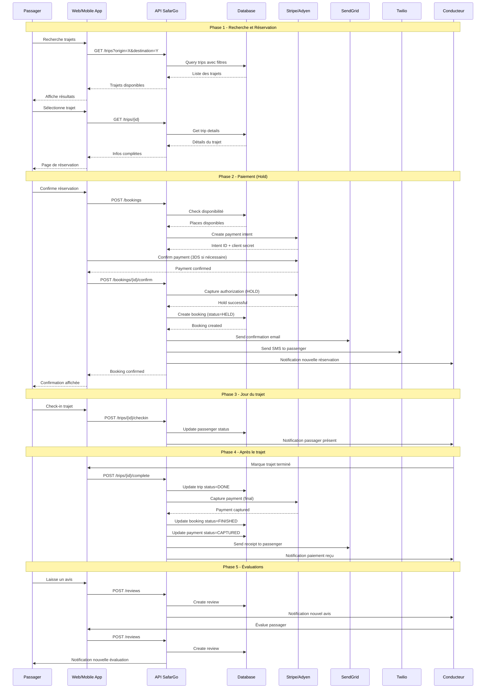

# Diagramme de Séquence - Processus de Réservation

## Vue d'ensemble

Ce diagramme illustre le processus complet de réservation d'un trajet avec paiement en escrow.

## États de la Réservation

1. **PENDING**: Réservation initiée, en attente de paiement
2. **HELD**: Paiement autorisé (hold), en attente du trajet
3. **CONFIRMED**: Réservation confirmée par le conducteur
4. **CANCELLED**: Annulée (remboursement automatique si HELD)
5. **FINISHED**: Trajet terminé, paiement capturé

## Gestion des Erreurs

### Échec du Paiement
- Annulation automatique de la réservation
- Libération des places
- Notification au passager

### Annulation par le Conducteur
- Remboursement automatique du hold
- Notification au passager
- Proposition de trajets alternatifs

### Annulation par le Passager
- Si > 24h avant: Remboursement complet
- Si < 24h: Frais d'annulation (10%)
- Si < 2h: Pas de remboursement

### Litige
- Gel du paiement
- Ouverture d'un ticket support
- Médiation entre les parties
- Décision finale de l'admin